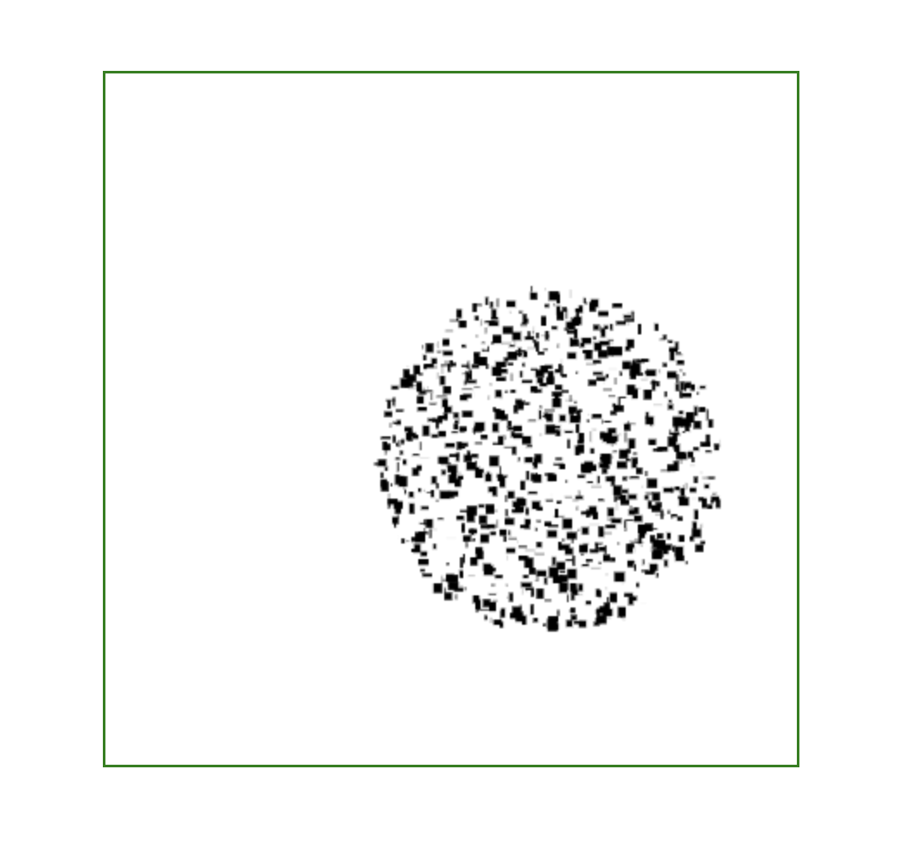

# BozoQuadtree
A quadtree is a data structure used to store data on a 2D plane. This quadtree implementation was written in JavaScript and it is able to store 2D rectangular shapes.

In example.js, a sample space of 400px by 400px is created to store 10000 rectangles. The user can move their mouse cursor onto the region or for mobile users touch, to reveal rectangles within a radius of 100px.

Go to https://cchjimmy.github.io/BozoQuadtree/ to see BozoQuadtree in action.

